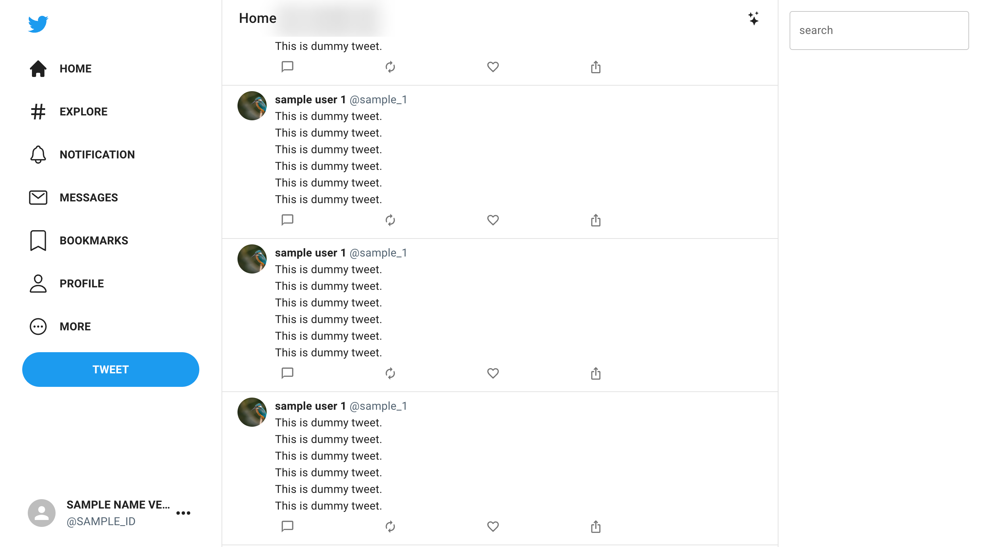

# React twitter clone app
This is a project aiming for cloning twitter web app by React.js and MUI.
(In progress)

## How to run
Make sure that Node.js is installed in your computer.

Then, move to `frontend` and excute the following command.
```shell
$ yarn install
$ yarn start
```

## Todo

- Make some feature pages.
  - Explore
  - Notification
  - Messages
  - Profile
  - Tweet
- Create backend API.

## Screenshots
